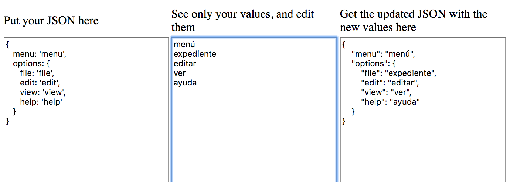

# JsonChangeVals
Change only the values of a JSON structure.

You can use this when you want to translate your JSON to another language:
1. Put your JSON on the left pane.
2. Copy the values on the middle pane.
3. Translate the values on translation service such as https://translate.google.com.
4. Get your translated JSON on the right pane.

To use: <a href="https://erasta.github.io/JsonChangeVals/index.html">https://erasta.github.io/JsonChangeVals/index.html</a>

Example: 
Start like this: 

Then translate to other languages the middle pane (on another application or site) and take the right pane: 
 
 
 

